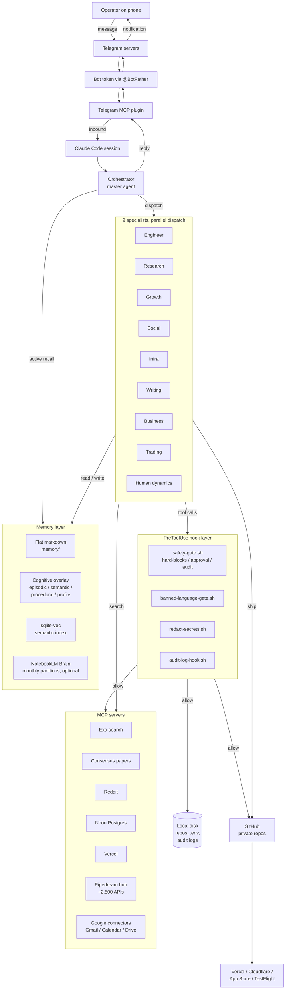

# Architecture

A single-page map of what Xantham is and how a Telegram message becomes work that ships.

## System diagram

## Components

- **Telegram plugin.** The phone-to-laptop channel. Code at `~/.claude/plugins/telegram/`. Inbound messages arrive as channel tags; outbound goes via the `reply` tool. Access is allowlist-gated by `/telegram:access`. Setup is a 2-minute `@BotFather` flow.
- **Orchestrator.** The master agent that reads every Telegram message, routes work, and sends the reply. Persona, voice, and rules live in `CLAUDE.md` at the install root. Personality file at `memory/feedback_personality_evolution.md` evolves over time, never resets.
- **9 specialists.** Engineer (`@kai`), Research (`@rose`), Growth (`@natalie`), Social (`@maya`), Infra (`@marco`), Writing (`@isabella`), Business (`@elena`), Trading (`@warren`), Human dynamics (`@chase`). Each lives in `.claude/agents/<name>.md` with its own scoped MCP allocation (typically 3-5 MCPs per agent, generated by `scripts/sync_agent_skills.py` from a YAML `mcps:` frontmatter field).
- **PreToolUse hook layer.** Four hooks fire before any tool call lands. `safety-gate.sh` is the load-bearing one (hard-block / approval-gate / allow buckets, see `SECURITY.md`). `banned-language-gate.sh` strips medical claims, marketing superlatives, and AI-tells from text destined for the Library, docs, or app strings. `redact-secrets.sh` strips credential patterns from anything that gets committed. `audit-log-hook.sh` writes a JSONL record of every tool call for post-hoc reconstruction.
- **Memory layer.** Four buckets on disk plus a semantic index. Details in the cross-section below.
- **MCP servers.** Project-scoped servers (Exa, Reddit) live in `.mcp.json`. User-scoped servers (Consensus, Neon, Vercel, Pipedream, Google connectors) live in `~/.claude.json`. Pipedream is a hub server wrapping ~2,500 third-party APIs, so one install unlocks Notion, Linear, Stripe, Airtable, etc. without per-app servers.

## Data flow

A typical end-to-end turn:

1. **Operator types on phone.** "Ship NearbyMe."
2. **Telegram routes** the message via its servers to your bot, which the local Telegram MCP plugin receives.
3. **Claude Code session reads** the inbound message as a tool result (the plugin tags it with `chat_id`, `message_id`, `user`, `ts`).
4. **Orchestrator parses** the command. For `ship <project>`, it loads the `cortana-ai-seo` skill (auto-fires on ship), checks the project's HANDOFF.md, and decides whether to dispatch a specialist or run inline.
5. **Active-recall pre-turn** fires if the message contains URLs, project names, or named persons. `scripts/active-recall.sh` surfaces top-3 relevant memory hits per entity from `memory/` (warm cache ~50ms, cold ~280ms).
6. **Specialist dispatched** with a context packet (what is asked, what is the project, what is constrained). For `ship`, `@marco` handles deploy verification.
7. **Specialist runs tool calls.** Each call passes through the PreToolUse hook layer. Allowed calls execute, blocked calls return a refusal that the agent sees and responds to.
8. **Audit log** records every tool call with timestamp, agent, command, decision.
9. **Orchestrator replies** to Telegram via the `reply` tool. The hook layer fires `log-telegram-hook.sh` async after the reply lands.
10. **Memory commit.** If the turn produced a non-trivial artifact (research finding, decision, correction), the orchestrator writes a new `memory/<type>_<topic>.md` file. A post-commit hook embeds it into sqlite-vec for cross-session retrieval.

## Memory layer cross-section

Xantham uses Karpathy's three-bucket pattern (Memory + Knowledge + Profile) plus a cognitive overlay.

- **`memory/` flat.** Top-level markdown files indexed by topic. Each file has frontmatter (`last_verified`, `ttl_days`, `description`) so freshness is auditable. `MEMORY.md` is the auto-regenerated index.
- **`memory/episodic/<YYYY-MM-DD>.md`.** Daily rolled rundown of telegram tail, reflection, commits. Generated at session end and on the daily roll hook.
- **`memory/semantic/<type>/`.** Type-bucketed durable knowledge (`feedback`, `project`, `user`, `reference`). The weekly compile pass (Sundays) folds short-lived notes into long-lived semantic files.
- **`memory/procedural/`.** How-tos, recipes, playbooks.
- **`memory/profile/<person>.md`.** Per-person profile files (collaborators, clients, internal stakeholders). Surfaced by active-recall when their name appears in inbound text.
- **`profile_<orchestrator>.md`.** The operator's Profile bucket. Mutable, session-aware narrative read at session start.
- **sqlite-vec semantic index.** Every committed markdown file is embedded by a post-commit hook (default model: `nomic-embed-text` via Ollama). Queried by `scripts/memory-search.sh <query>`.
- **NotebookLM Brain (optional).** Monthly partitions to stay under NotebookLM's ~100-source cap. Pushed to on every `sync` step. Queried via the `brain <question>` Telegram command. Skippable in Simple mode if you do not want Google in the loop.

## Safety layer cross-section

The hook layer is the security boundary, see `SECURITY.md` for the full threat model. Architecturally:

- **Hook trigger.** Claude Code's `PreToolUse` event fires before any tool call (Bash, Edit, Write, Read on sensitive paths, MCP tool invocations). The hook scripts in `.claude/hooks/` execute and decide allow / deny.
- **Three buckets.** Hard-blocked (no approval possible, hook refuses regardless of state), approval-gated (blocked until exact command is written to `data/approved.txt` with a 30-day TTL), allowed-with-audit (passes through but logged).
- **Sync rule.** Project-level gate (`.claude/hooks/safety-gate.sh`) and global gate (`~/.claude/hooks/safety-gate.sh`) must stay in sync. `scripts/sync-safety-gates.sh` is the canonical sync tool. Drift means a destructive command might slip through in another project.
- **Banned-language gate.** Independent of the safety gate. Fires on Write/Edit and on Telegram replies. Blocks medical-claim words, marketing superlatives, and AI-tells from leaking into committed content. Allowlist exceptions at `Library/app-store-compliance/banned-language-allowlist.md`.

## Where the code lives

- **Blueprint files.** `xantham-system-v31.md` (landing, ~4900 lines) and `xantham-templates-v31.md` (template bodies, ~9100 lines). Both at the public repo root.
- **Generated install.** Lives at your install directory (default `~/Documents/<OrchestratorName>/`). Includes `CLAUDE.md`, `.claude/`, `.mcp.json`, `memory/`, `scripts/`, `data/`, `docs/`, `blueprints/`, `agent-memory/`, `Library/`.
- **Per-project repos.** Each registered project lives in its own folder anywhere on your machine. The orchestrator learns about it via `docs/projects.md`. Each project ships its own `CLAUDE.md`, `HANDOFF.md`, `FEATURES.md`.
